### Product Designer &amp; Design Technologist

**I design products where behavior, systems, and technology meet.**

My work begins before the interface. I frame ambiguous problems, study users and
markets, define product logic, and turn ideas into testable, scalable, and
build-ready experiences.

Across SaaS, B2B, ERP, e-commerce, and AI-assisted products, I have designed
complex workflows, operational tools, design systems, and end-to-end product
experiences.

I do not treat design as a visual layer added at the end. I use it as a system
for reducing uncertainty, aligning teams, and creating clearer relationships
between user needs, business goals, and technology.

I am particularly interested in AI-native experiences, behavior-informed design,
scalable systems, and the invisible decisions that shape how people move through
digital products.

---

<picture>
  <source media="(prefers-color-scheme: dark)" srcset="assets/contributions-dark.svg">
  
</picture>

---

**[Portfolio](https://paryabahrami.ir)** &nbsp;·&nbsp;
[LinkedIn](https://linkedin.com/in/paryabhrmi) &nbsp;·&nbsp;
[Email](mailto:paryabhrmii@gmail.com)
